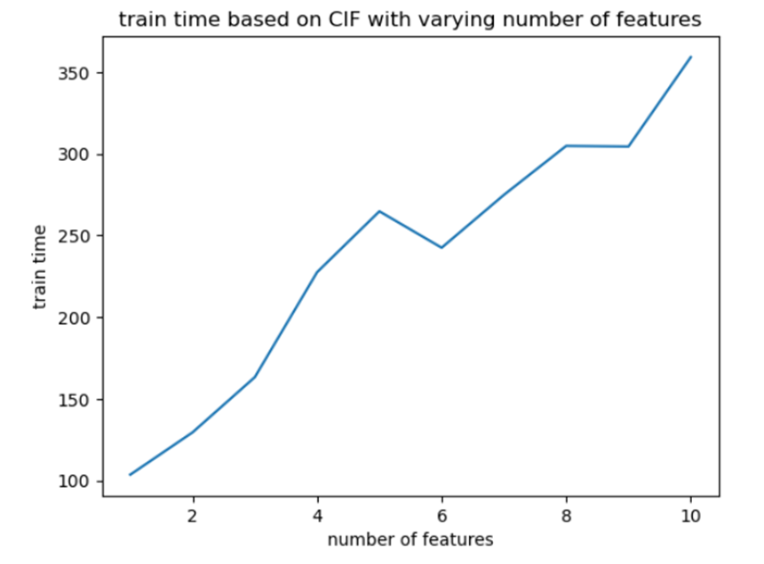
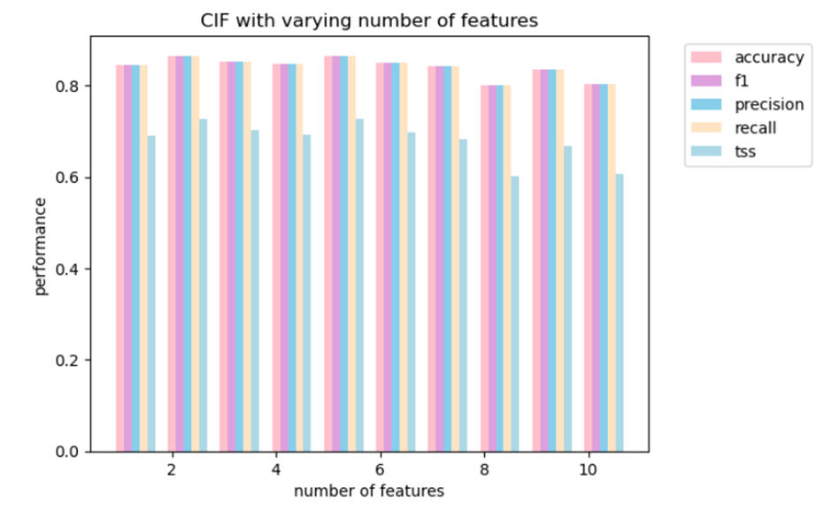
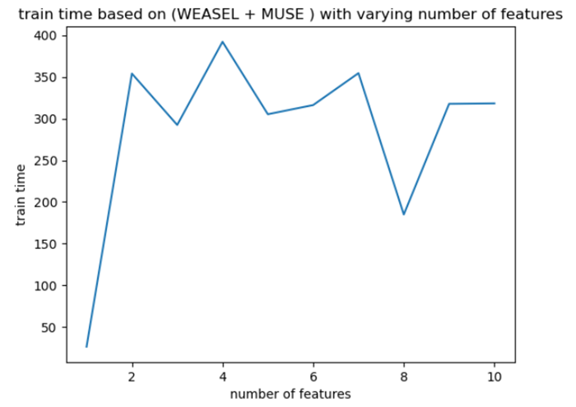
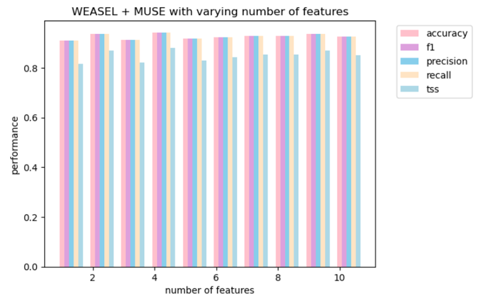
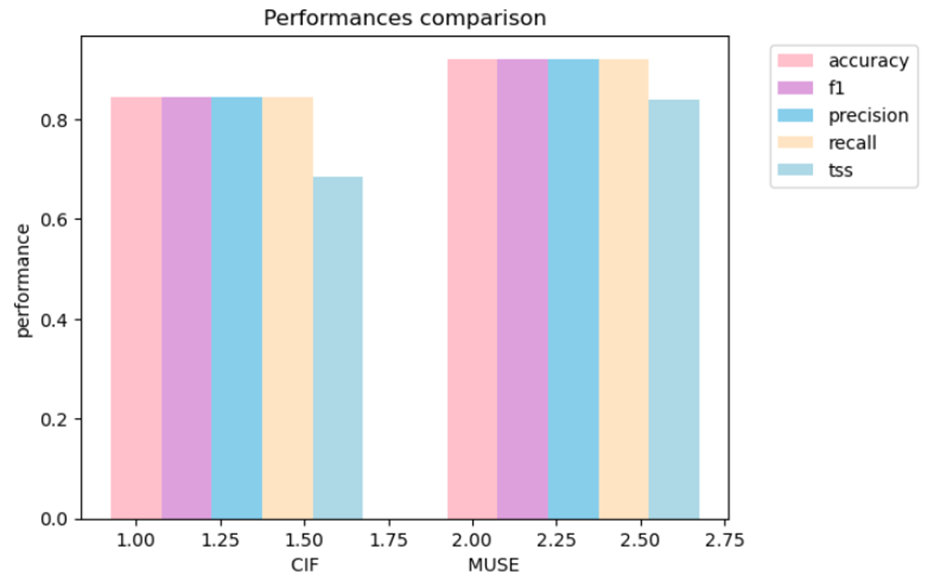
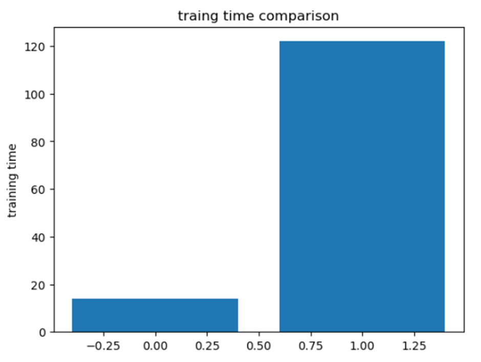

# Solar Flare Prediction

## Overview:
The aim of this project is to develop a predictive model for solar flares based on historical data of solar magnetic field parameters. The goal is to classify solar active regions into two categories: flaring (X- and M-classes) and non-flaring (C-, B-, and Q-classes). This midway report provides an overview of the progress made up to this point in the project.

## Dataset:
The dataset includes information on five classes of solar flares: X, M, C, B, and Q. For our classification task, we've categorized X and M classes as the positive class (flaring regions), while C, B, and Q classes represent the negative class (non-flaring regions).
https://dmlab.cs.gsu.edu/solar/data/data-comp-2020/

## Key Steps Achieved:
1. Data Collection:
We have obtained the dataset from Kaggle and the above link, which consists of a time series of solar magnetic field parameters. The dataset includes information on five classes of solar flares: X, M, C, B, and Q. For our classification task, we've categorized X and M classes as the positive class (flaring regions), while C, B, and Q classes represent the negative class (non-flaring regions).
2. Data Preprocessing:
Data preprocessing has been performed to ensure that the dataset is ready for modeling. This includes handling missing values and any potential outliers.
3. Feature Engineering:
Feature engineering is a crucial part of our project. We've extracted relevant features from the time series data to represent the behaviour of solar magnetic fields. These features include statistical measures, spectral features, and temporal patterns. Feature engineering is essential for capturing the underlying patterns and characteristics of solar magnetic fields.
4. Data Resampling:
To address class imbalance, we have performed data resampling. We've balanced the dataset by randomly selecting samples from each class to ensure that the model's training data is representative of both flaring and non-flaring regions. This is important to prevent bias in the model.
5. Traditional Model Implementation:
We have implemented our first traditional machine learning model, which is the Canonical Interval Forest (CIF). The CIF is an interval-based model that can capture temporal patterns in the data. This model is one of the options we are exploring to classify solar active regions. Explored and implemented Dictionary-based model. Models were successfully implemented, allowing us to capture different facets of the data. A comparative analysis was conducted to evaluate the performance of each model.
6. Model Training and Evaluation:
Trained selected models on pre-processed and resampled data and evaluated their performance. Models were trained on the prepared dataset, and their performance was assessed using various metrics, including Accuracy, Precision, Recall, F1 score, and True Skill Statistic (TSS). The evaluation provided insights into the predictive capabilities of each model.

## Challenges:
The initial dataset was fragmented across three different files and exhibited imbalanced classes, which could potentially lead to skewed model performance. In order to resolve this imbalances classes in the time series data we used resampling techniques. This involved oversampling the minority classes and under-sampling the majority classes, depending on the specifics of the data. Further, consolidating the data to one unified dataset and obtained more reliable and meaningful results.

## Result:
In the course of this project, we successfully implemented and evaluated two traditional machine learning models, namely the Canonical Interval Forest (CIF) and a Dictionary-based model. The CIF, being an interval-based model designed to capture temporal patterns, and the Dictionary-based model, each contributed to our understanding of the solar active region classification task. Our comparative analysis assessed their performance across key metrics. 

The Dictionary-based model outperformed the Canonical Interval Forest (CIF) model with accuracy of 92.11%, where the accuracy of CIF model is 84.44%. Other metrics like True skill statistic for Dictionary-based model is 83.83% and for the CIF model is 68.52%. These results provide valuable insights into the models' capabilities, with the Dictionary-based model demonstrating superior performance across all evaluated metrics.

## Output:

Fig 1. Training CIF
 

Fig 2.CIF Performance metrics

Fig 3. Training Dictionary-based model
 

Fig 4. Dictionary-based model Performance metrics
 

Fig 5. Performance Analysis of CIF vs Dictionary-based model
 

Fig6. Comparing the Training time of CIF vs Dictionary-based model
